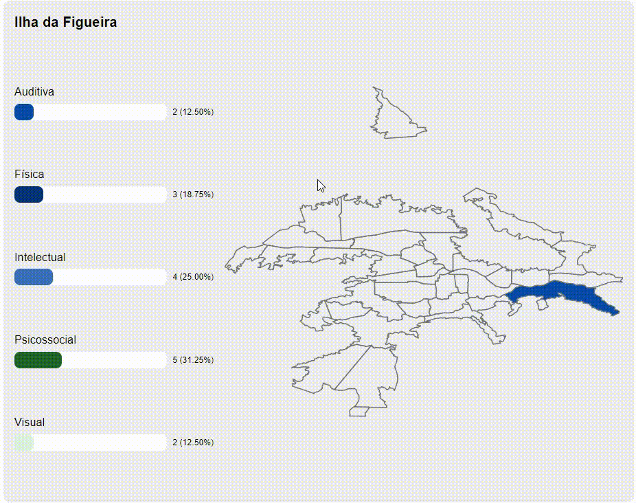
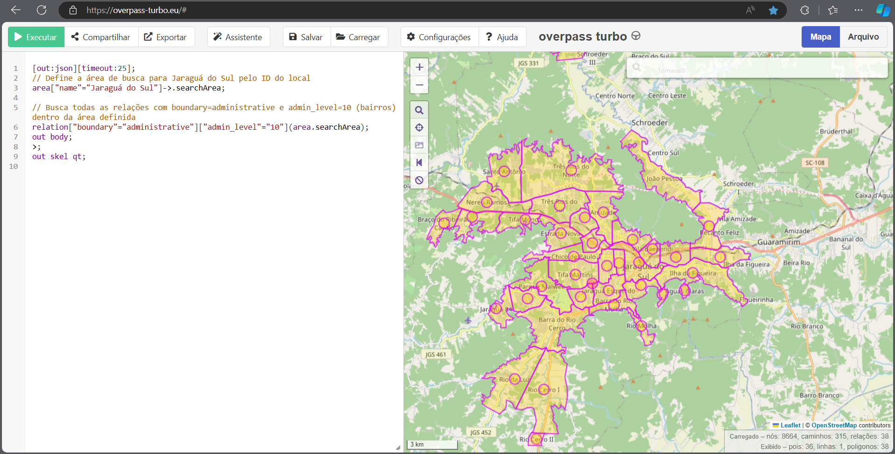

## Como foi feito?

### Baixar GeoJSON
GeoJSON é um padrão de estrutura de JSON que é entendível para mapas, imagine como uma forma de entender o mapa em formato de texto.

Para consguir o GeoJSON de qualquer lugar do mundo (se disponível no site), acesse overpass.turbo

[overpass.turbo](http://overpass-turbo.eu/)

Exemplo de Jaraguá do Sul


```json
[out:json][timeout:25];
// Define a área de busca para Jaraguá do Sul pelo ID do local
area["name"="Jaraguá do Sul"]->.searchArea;

// Busca todas as relações com boundary=administrative e admin_level=10 (bairros) dentro da área definida
relation["boundary"="administrative"]["admin_level"="10"](area.searchArea);
out body;
>;
out skel qt;
```

Após conseguir a área desejada (seja uma cidade, estado ou país), exporte em GeoJSON e salve o arquivo.

### Modificando o GeoJSON

Como é possível ver na imagem anterior, também é exportado os pontos que ficam em cima de cada área.

Esses pontos são desnecessários para o nosso mapa, então é interessante remover eles do arquivo GeoJSON.

Eles se parecem com algo assim e normalmente ficam no final do arquivo:

```json
{
  "type": "Feature",
  "properties": {
    "@id": "node/2693510539",
    "@relations": [
      {
        "role": "label",
        "rel": 3501928,
        "reltags": {
          "admin_level": "10",
          "boundary": "administrative",
          "name": "Vila Nova",
          "type": "boundary"
        }
      }
    ]
  },
  "geometry": {
    "type": "Point",
    "coordinates": [
      -49.0793265,
      -26.4974522
    ]
  },
  "id": "node/2693510539"
}
```

Além disso, o overpass.turbo exporta as coordenadas no modelo `[longitude, latitude]`, mas o D3 espera no modelo `[latitude, longitude]` (ou ao contrário, não me lembro ao certo).

Para tal, é necessário inverter as coordenadas de todos os polígonos e pontos do arquivo GeoJSON. Na prática é alterar arr[0] por arr[1] e arr[1] por arr[0] de todas as coordenadas.

Nesse caso, utilizei um script em Python no Google Colab para acelerar meu processo:

```python
!pip install geojson

import geojson

# Carregar o arquivo GeoJSON
with open('./jaragua-do-sul-bairros.json', 'r') as f:
    data = geojson.load(f)

# Função para inverter as coordenadas
def inverter_coordenadas(coordinates):
    return [[lat, lon] for lon, lat in coordinates]

# Iterar sobre cada "Feature" e inverter as coordenadas
for feature in data['features']:
    if feature['geometry']['type'] == 'Polygon':
        # Para cada Polygon, inverter as coordenadas
        feature['geometry']['coordinates'] = [
            inverter_coordenadas(polygon) for polygon in feature['geometry']['coordinates']
        ]
    elif feature['geometry']['type'] == 'MultiPolygon':
        # Para cada MultiPolygon, inverter as coordenadas
        feature['geometry']['coordinates'] = [
            [inverter_coordenadas(polygon) for polygon in multipolygon]
            for multipolygon in feature['geometry']['coordinates']
        ]

# Salvar o novo arquivo com coordenadas invertidas
with open('./jgs-inverted.json', 'w') as f:
    geojson.dump(data, f)

print("As coordenadas foram invertidas e o novo arquivo foi salvo.")
```

Nota: lembre-se de alterar os caminhos e nomes para os seus arquivos.

### Criando o mapa

Com o arquivo GeoJSON pronto, é hora de criar o mapa.

Para isso, utilizei o D3.js, uma biblioteca JavaScript para manipulação de documentos baseados em dados.

O exemplo de utilização se encontra em `src/Jaragua/index.tsx`.

Dependências:
- `npm i d3`
- `npm i @types/d3`

Referências:
- https://observablehq.com/@matijapiskorec/drawing-maps-from-openstreetmap-with-d3o
- https://github.com/d3/d3-geo/issues/118
